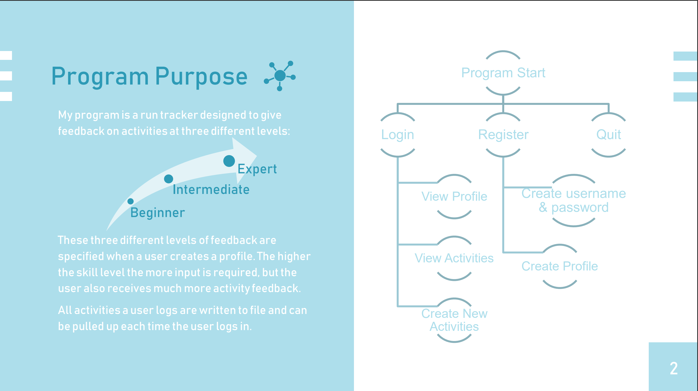
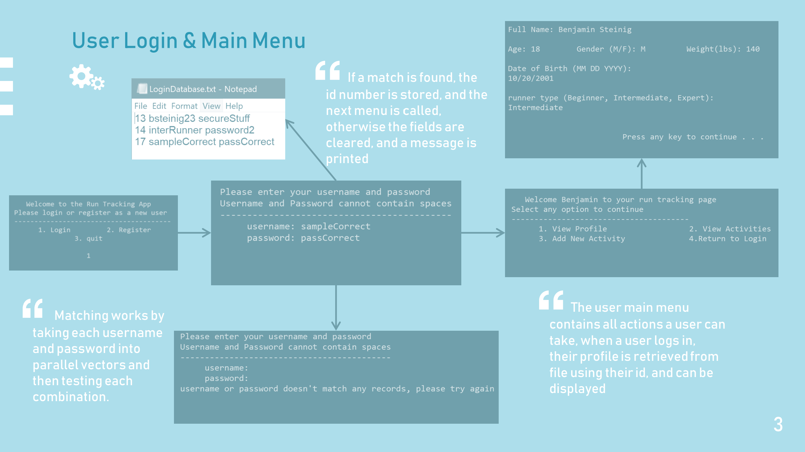

# fitness-tracker-app
This is a project that I wrote as a capstone for my Dual Enrollment C++ course. As a long time runner I wanted to create a program that could be useful to runners like me that wanted to get the same analytics from their activities that many smart watches offered. This application allows users of varying skill levels to receive analytics tailored to their needs. 

The most complex aspect of this program was the inheritance feature which allowed me to create different levels of input and feedback data for users. For example, a beginner runner might only be interested in their average heart rate and pace while a more experienced runner would want information about their aerobic zones, target heart rate, and intensity of the exercise. 
## Program Purpose 

## Login.h & LoginImp.cpp

## Activity.h and derived classes

## Windows Screen Control
In order to create more streamlined user registration and profile forms I created a Windows Screen control handle which allowed me to position console elements and the users' input cursor
